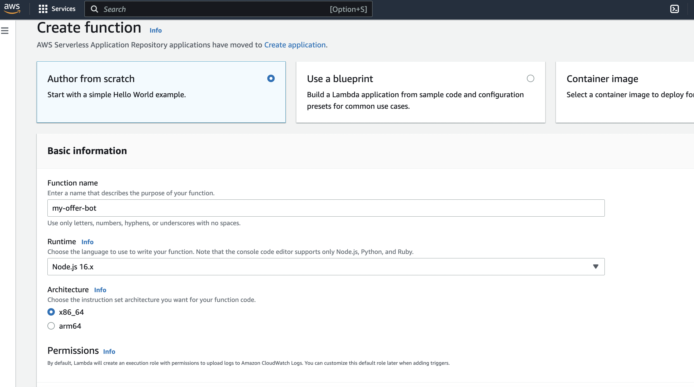
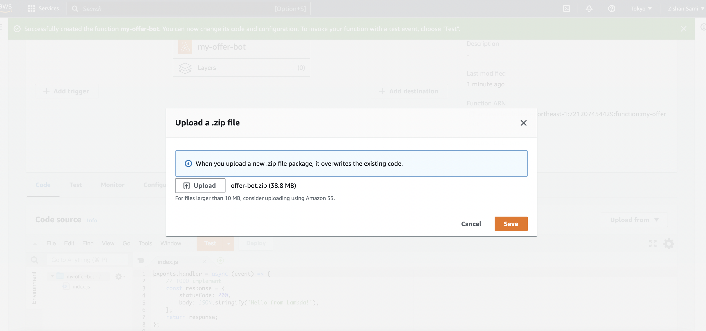
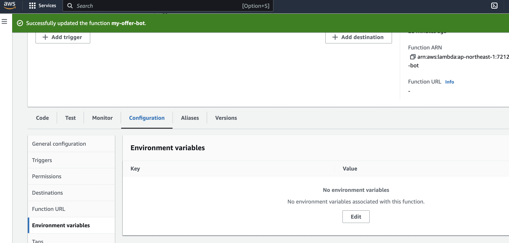
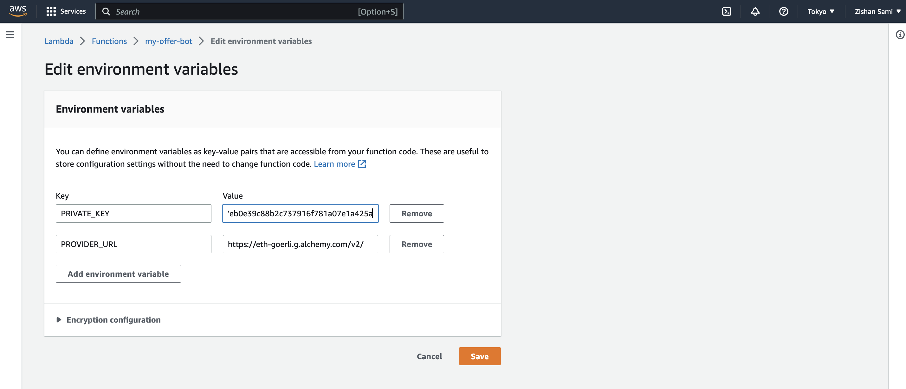
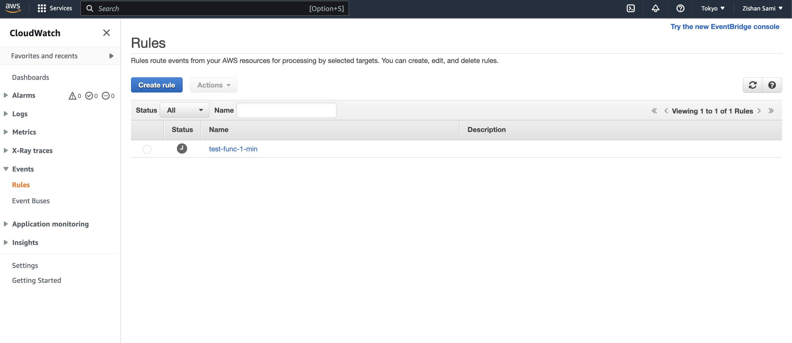
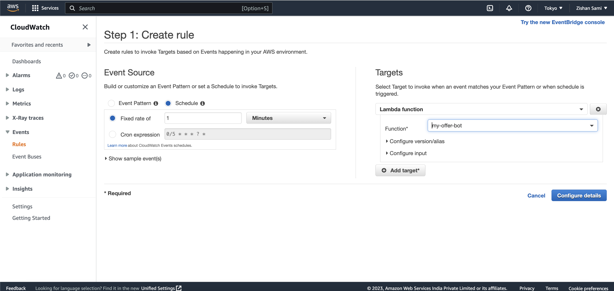
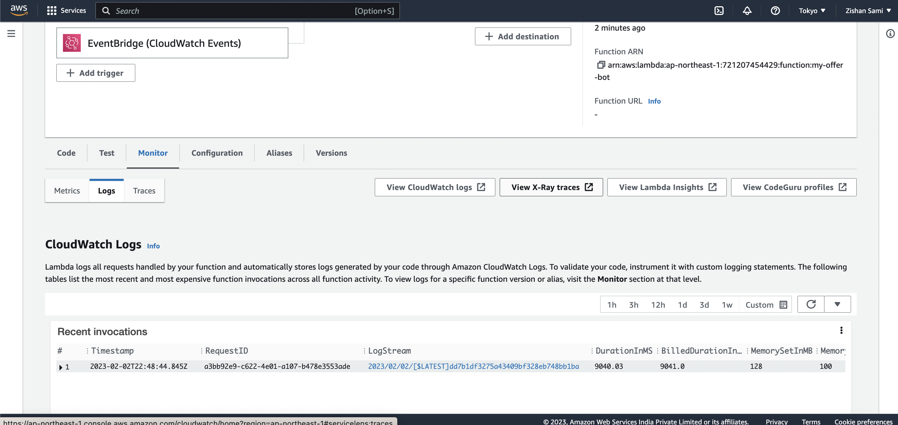

# NiftyApes Offer Bot

## Install
### NVM aka Node Version Manager
Windows: https://github.com/coreybutler/nvm-windows

Linux/MacOS: https://github.com/nvm-sh/nvm

Supported Node versions due OS are v16.13.*
### Offer Bot
After node is installed, run `npm install --global yarn`
To then install the bot, run `yarn install`
## Configuration
Copy **.env.dist** and add missing values

### Mandatory

**PROVIDER_URL**: your rpc provider url, such as aclhemy.com, infura.io or moralis.io etc.

**PRIVATE_KEY**: Private key of wallet that should be used for creating offers

## Run Locally
### Run start-bot.js with --help to see all the required parameter details
```console
foo@bar:~$ node src/start-bot.js --help
start-bot.js [command]

Commands:
  start-bot.js offer-bot  start offer bot

Options:
  --help                        Show help                              [boolean]
  --version                     Show version number                    [boolean]
  --nftContractAddress, --addr  Address of the nft collection to create offer on
                                                             [string] [required]
  --chainId                     Chain Id of the network      [string] [required]
  --ltv                         Loan to Value in percentage  [string] [required]
  --maxOfferValue               Max allowed loan offer per NFT
                                                             [string] [required]
  --apr                         APR in percentage            [string] [required]
  --duration                    Loan duration in number of days
                                                             [string] [required]
  --floorOfferLimit             Max number of Nfts for floor offer limit
                                                         [string] [default: "1"]
  --expiration                  Offer expiration time in minutes
                                                             [string] [required]
  --runInLoop                   Run bot indefinetly with expiration period as de
                                lay                   [boolean] [default: false]
  --dryRun                      Dry run               [boolean] [default: false]
```

### Example Runs: 
Create one floor Offer for the given contract on GOERLI with LTV of 0.1%, APR 5%, valid for 2 days, and exipration of 10 minutes. Setting floorOfferLimit to 3 and maxOfferValue to 0.1 ETH
```shell
 node src/start-bot.js --nftContractAddress 0xbc4ca0eda7647a8ab7c2061c2e118a18a936f13d --chainId 0x5 --duration 2 --floorOfferLimit 3  --ltv 0.1 --maxOfferValue 0.1  --expiration 10 --apr 2
```

To run the bot indefinitely with expiration as delay, just add --runInLoop to the command.
```shell
 node src/start-bot.js --nftContractAddress 0xbc4ca0eda7647a8ab7c2061c2e118a18a936f13d --chainId 0x5 --duration 2 --floorOfferLimit 3  --ltv 0.1 --maxOfferValue 0.1  --expiration 10 --apr 2 --runInLoop
```


## Setting up on AWS Lambda
After [installing locally](## Install):

### Create the zip

```bash
zip -r offer-bot.zip .
```

### Install to AWS Lambda

- In Lambda Functions, create function
- On the Create function page:
  - Give the function a name
  - Use `Node.js 16.x` for the runtime and `x86_64` for architecture
  - Choose an existing role or create a new one
  - Click Create Function


- Under Function code, select "Upload a .zip file" from the Code entry type drop-down
- Click Upload and select the `offer-bot.zip` file


- To Add the environment variable, goto `Configuration` tab, then `Environment Variable` on the left menu-


- (repeat for all environment variables):
  - Key: PRIVATE_KEY
  - Value: Your_PRIVATE_KEY
- Save


- Increase the timeout period, goto `Configuration` tab --> `General configuration` --> `Edit`
- Change timeout from 3 sec to `30 sec`. `Save`.

- To test the setup, goto `Test` tab, give any name in the event name, and paste the following:
```json
{
  "nftContractAddress": "0xbc4ca0eda7647a8ab7c2061c2e118a18a936f13d",
  "chainId": "0x5",
  "duration": 2,
  "floorOfferLimit": 3,
  "ltv": 0.1,
  "maxOfferValue": 0.1,
  "expiration": 1,
  "apr": 2
}
```
 - click `Test`.

A successful run will have following output logs:
```bash
START RequestId: a3bb92e9-c622-4e01-a107-b478e3553ade Version: $LATEST
2023-02-02T22:48:37.486Z	a3bb92e9-c622-4e01-a107-b478e3553ade	INFO	2023-02-02T22:48:37.485Z requesting rarible for floorPrice..
2023-02-02T22:48:38.926Z	a3bb92e9-c622-4e01-a107-b478e3553ade	INFO	{
  highestSale: 0,
  floorPrice: null,
  marketCap: null,
  listed: 0,
  items: 0,
  owners: 0,
  volume: 0
}
2023-02-02T22:48:38.926Z	a3bb92e9-c622-4e01-a107-b478e3553ade	INFO	2023-02-02T22:48:38.926Z starting offer creation..
2023-02-02T22:48:39.746Z	a3bb92e9-c622-4e01-a107-b478e3553ade	INFO	2023-02-02T22:48:39.746Z requesting NiftyApes API to save the created offer...
2023-02-02T22:48:44.833Z	a3bb92e9-c622-4e01-a107-b478e3553ade	INFO	2023-02-02T22:48:44.833Z save offer request completed.
2023-02-02T22:48:44.834Z	a3bb92e9-c622-4e01-a107-b478e3553ade	INFO	2023-02-02T22:48:44.833Z new offer created. { offerValue: '0.000000000000000000' }
END RequestId: a3bb92e9-c622-4e01-a107-b478e3553ade
REPORT RequestId: a3bb92e9-c622-4e01-a107-b478e3553ade	Duration: 9040.03 ms	Billed Duration: 9041 ms	Memory Size: 128 MB	Max Memory Used: 100 MB	Init Duration: 586.74 m
```


#### To Set up automatic triggers

- Search `Cloudwatch` in the search bar and click on the top result
- Click on `Event` option on the left menu bar
- Select `Rules` from the dropdown


- Click `Create Rule` button
- Under Event Source, choose `Schedule`
- Set timer as fixed rate of 1 minutes
- On the right, set target as you newly created lambda function. `my-offer-bot`
- Click on `Configure Details`

- Type a name (eg: my-offer-bot-1min) for the rule and click on `Create rule` button
- Go back to your newly created lambda function, goto `Monitor` tab --> `Logs` and check the logs.
